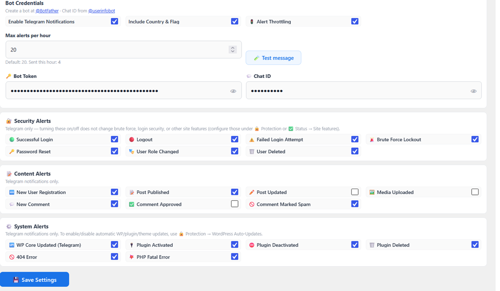
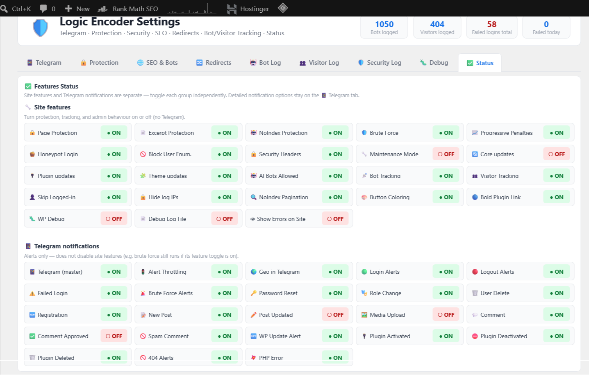
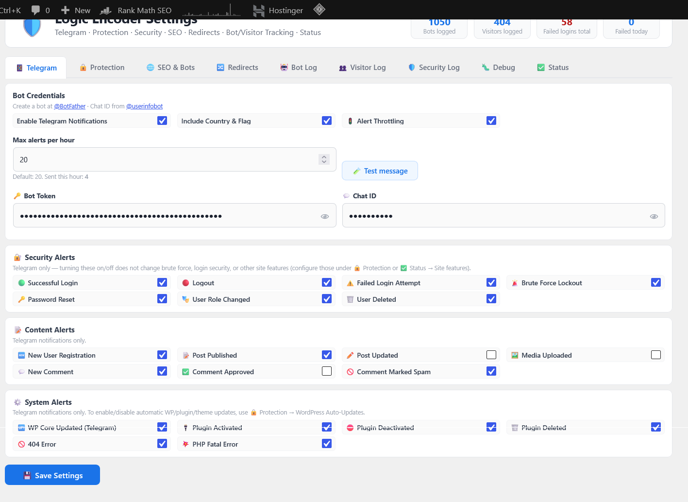
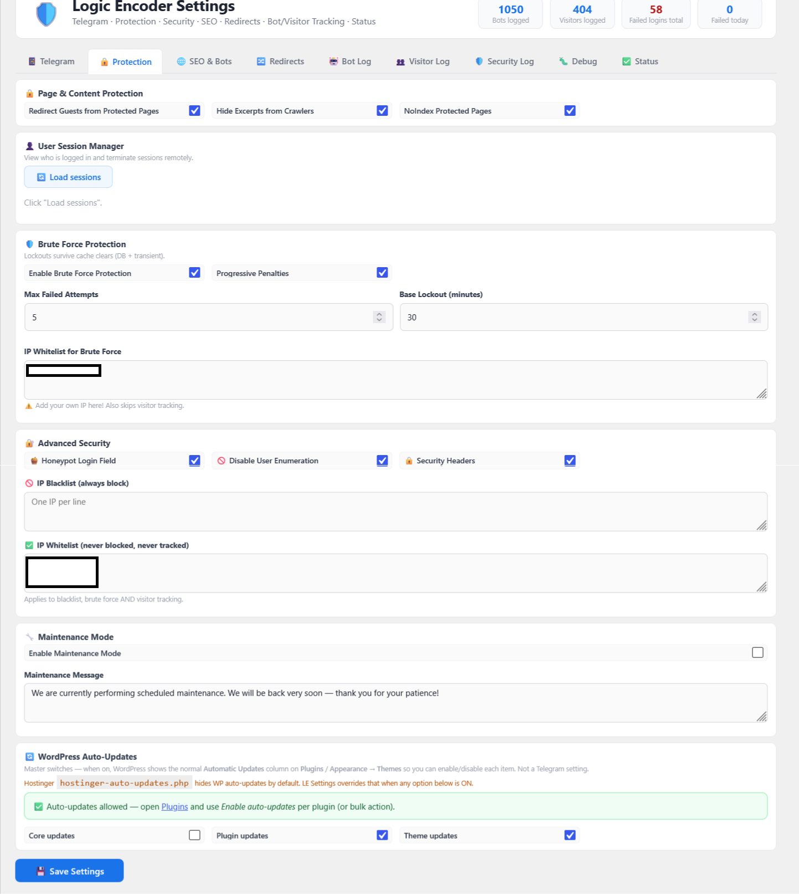
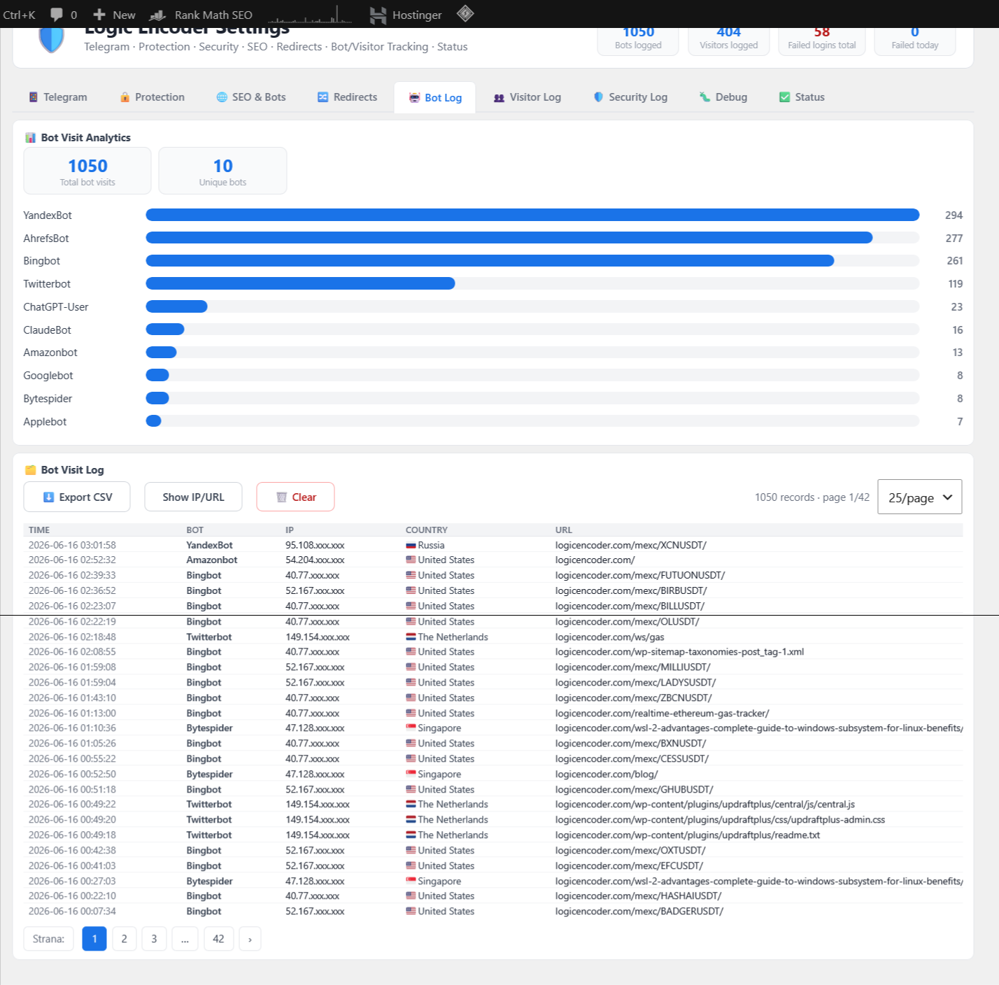
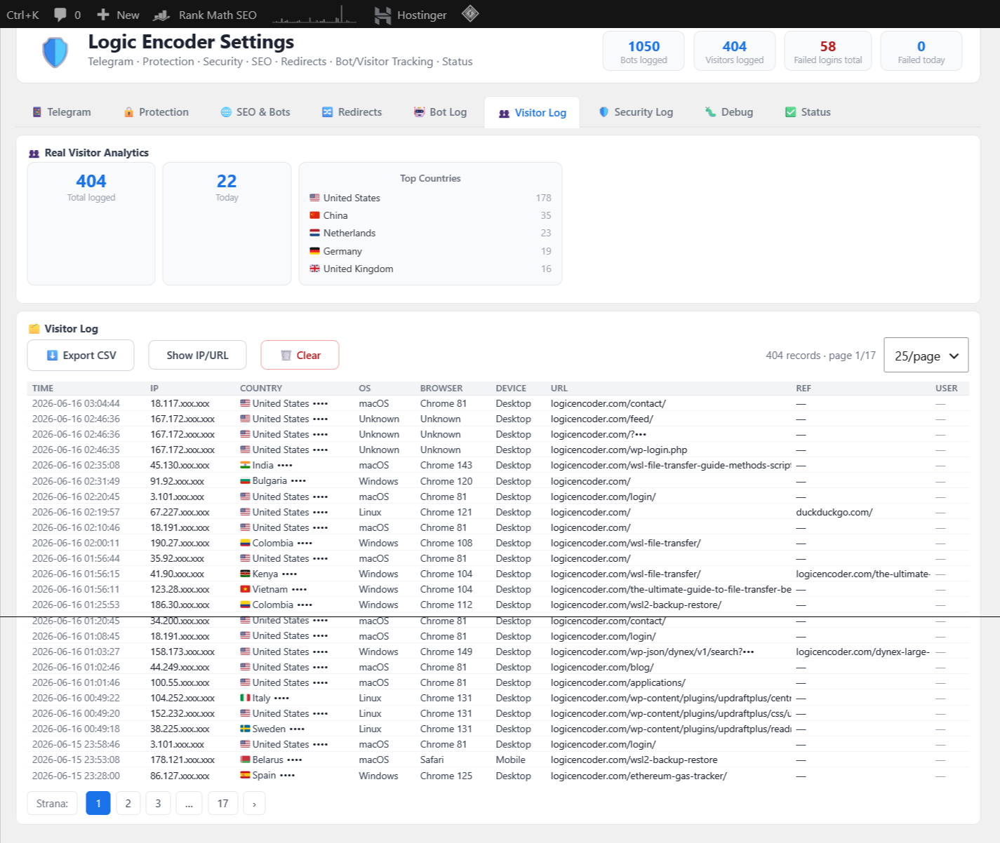
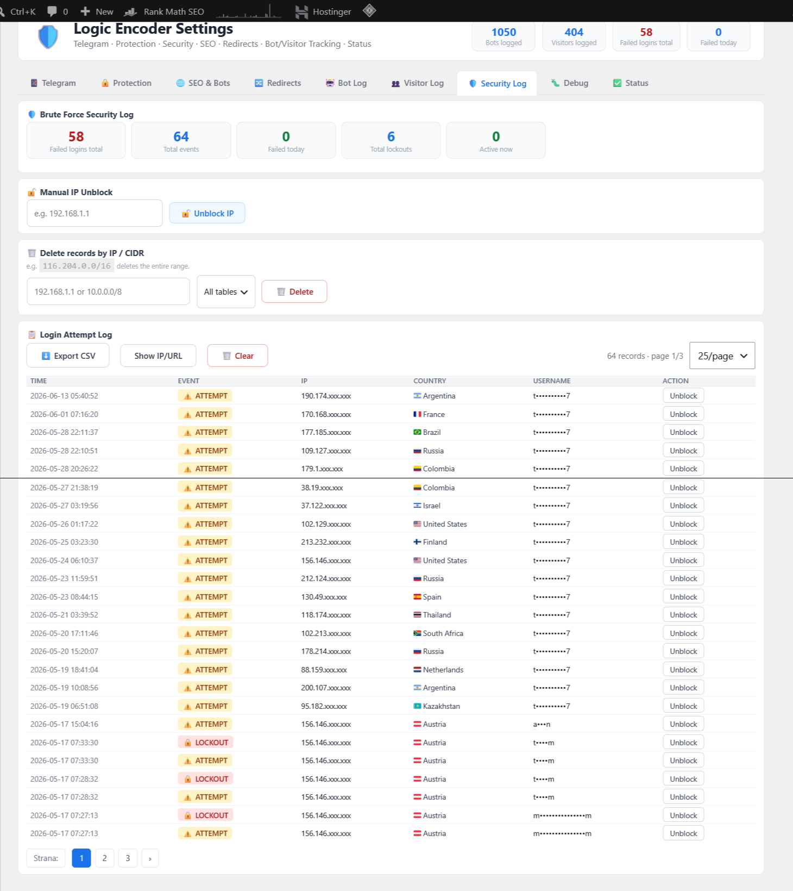
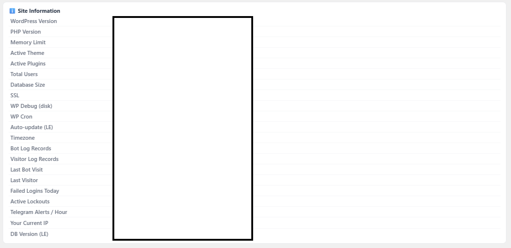

# LE Settings — WordPress plugin

**LE Settings** is the operator control plane for [logicencoder.com](https://logicencoder.com): one wp-admin home for **security hardening**, **Telegram incident alerts**, **crawler vs human request logging**, **maintenance mode**, and **WordPress housekeeping**. You configure behaviour once; lockouts, headers, 503 pages, bot classification, and log rows apply on every front-end request without a separate SaaS dashboard.

The plugin is **not** the Telegram Mini App shop ([le-shop-plugin](https://github.com/logicencoder/le-shop-plugin-overview)), not the crypto app store backend, and not the deep analytics product ([wp-visitor-stats-plugin](https://github.com/logicencoder/wp-visitor-stats-plugin-overview)). It is the lightweight **site-ops layer** that sits beside the Logic Encoder theme and sibling plugins — enough signal to run production safely, export CSV evidence, and get paged on Telegram when something changes.

## Tech stack

| Layer | Technologies |
|-------|--------------|
| WordPress plugin | PHP single-file (`le-settings.php`, ~4.3k LOC), inline admin CSS/JS |
| Persistence | WordPress options (`le_settings` blob) + MySQL log tables |
| Alerts | Telegram Bot API (`sendMessage`, HTML), optional geo line via ip-api.com |
| Security | Login hooks, transients, IP CIDR matching, optional response headers |
| Logging | `{prefix}le_bot_log`, `{prefix}le_visitor_log`, `{prefix}le_bf_log` |
| Integration | `le_get_settings()` for theme and LE plugins; AJAX admin tools |
| Hosting | WordPress on shared hosting; wp-admin only (no public shortcode UI) |

## Why operators use it

Running a content-heavy WordPress site with trading dashboards, plugin fleet, and member flows means dozens of moving parts: brute-force probes on `wp-login.php`, crawlers hammering `/mexc/*` URLs, plugin activations after deploy, and the need to prove who hit what without opening phpMyAdmin. LE Settings centralises that work:

- **React on Telegram** when logins fail, roles change, or plugins toggle — instead of discovering it hours later in a log file.
- **Separate bots from humans** with an editable User-Agent list so SEO crawlers do not pollute visitor analytics.
- **Retain full request history in MySQL** (no row cap) for audits, CSV export, and IP-range purge when cleaning noise.
- **Harden login** with progressive lockouts, honeypot, enumeration blocks, and session kill switches.
- **Flip maintenance mode** or auto-update policy without SSH — while keeping `DISABLE_WP_CRON` + system cron documented in Status.

Front-end effects run on `init` / `template_redirect` / auth hooks; the admin UI is read-heavy on log tabs and write-heavy on configuration tabs.

## Admin console layout

Top-level wp-admin menu **Logic Encoder** (shield icon, early sidebar). The header shows four live counters: **bots logged**, **visitors logged**, **failed logins total**, and **failed logins today** — so you see incident pressure before opening a tab.

Nine tabs cover configuration and forensics:

| Tab | Purpose |
|-----|---------|
| **Telegram** | Bot token, chat ID, throttle, grouped notification toggles, test send |
| **Protection** | Brute force, IP lists, sessions, honeypot, maintenance, auto-updates |
| **SEO & Bots** | Homepage meta field, bot UA list, tracking toggles, sensitive-field masking |
| **Redirects** | Editable 301 / 302 / 410 rule table (JSON-backed) |
| **Bot Log** | Crawler volume bars + paginated table, CSV export, clear |
| **Visitor Log** | Human traffic summary, top countries, paginated table, CSV export |
| **Security Log** | Login attempts, lockouts, manual unblock, delete-by-IP/CIDR |
| **Debug** | `WP_DEBUG` triad synced to `wp-config.php` + tail of `debug.log` |
| **Status** | Feature grid, notification grid, site info (WP/PHP/SSL/cron) |

Configuration tabs use **Save Settings**; log tabs use export, pagination, and AJAX tools without touching the main save form.

**Screenshot coverage (complete):** Portfolio images show the seven tabs where visual context matters — **Telegram**, **Protection**, **Bot Log**, **Visitor Log**, **Security Log**, and both **Status** views (feature grid + site information). **SEO & Bots**, **Redirects**, and **Debug** are plain configuration screens; they are documented in prose below and intentionally have no gallery images.

### Status — feature and notification grids

The **Status** tab opens with two dense grids so you can answer “what is ON?” in one glance.

**Site features** lists protection, tracking, SEO, and UI toggles (maintenance, brute force, honeypot, bot/visitor tracking, hide sensitive fields in logs, pagination noindex, plugin menu highlighting, and more). Each row is a label with an **ON** / **OFF** badge — green when active, red when disabled — so misconfiguration stands out before you drill into a tab.

**Telegram notifications** mirrors the same pattern for alert channels: security events (login, logout, failed login, lockout, password reset, role change, user delete), content events (register, post, comment, spam), and system events (core/plugin lifecycle, 404, PHP fatal). The master **Telegram** switch and **Alert Throttling** appear here too; throttling caps messages per hour so a brute-force storm does not exhaust your bot quota.

## Telegram alerts

The **Telegram** tab wires the site to a private bot chat. Three credential fields gate everything: **Enable Telegram Notifications**, **Bot Token**, and **Chat ID** (masked in the UI). **Include Country & Flag** appends a geo line from the client IP when ip-api lookup succeeds. **Alert Throttling** limits messages per hour with a live counter so you know how close you are to the cap.

Notifications are grouped into checklists:

| Group | What you can enable |
|-------|---------------------|
| **Security** | Successful login, logout, failed login, brute-force lockout, password reset, role change, user deleted |
| **Content** | Registration, new post, post updated, media upload, comment, approved, spam |
| **System** | Core updated, plugin activated / deactivated / deleted, 404 hit, PHP fatal on shutdown |

**Test message** sends immediately — no need to trigger a real failure to validate token and chat ID. Toggles only control Telegram output; the underlying security behaviour (e.g. lockout thresholds) lives under **Protection**.

## Protection and login hardening

The **Protection** tab concentrates defences around `wp-login.php`, member content, and session hygiene.

**Page & content protection** toggles redirect guests away from protected routes, hide excerpts from crawlers, and emit noindex on premium paths — complementary to theme templates.

**User session manager** loads active sessions per user and supports **kill all sessions** over AJAX when an account is compromised.

**Brute-force lockout** counts failures per IP in a sliding window. Exceed **Max Failed Attempts** → timed lockout written to options and the security log. **Progressive penalties** multiply duration for repeat offenders. **IP whitelist (brute force)** accepts CIDR lines so office or VPN exits never lock you out during testing.

**Advanced security** adds a login honeypot (hidden field bots fill), blocks user enumeration via author archives and trimmed REST user endpoints, and optionally sends `X-Content-Type-Options`, `X-Frame-Options`, and `Referrer-Policy` on front-end responses.

**IP blacklist** returns HTTP 403 for listed ranges before WordPress renders a page. **IP whitelist (global)** skips blacklist, brute-force tracking, **and** visitor logging — use for operator nets. Built-in logic also skips localhost, private LAN ranges, Hostinger origin noise (`92.113.0.0/16`), wp-admin referrers, and empty User-Agent rows so internal fetches do not flood the visitor log.

**Maintenance mode** serves a custom **503** with `Retry-After` to anonymous visitors while administrators keep wp-admin access.

**WordPress auto-updates** exposes core / plugin / theme toggles even when Hostinger mu-plugins hide the default UI — so you choose unattended patches deliberately.

## SEO, redirects, and bot classification

The **SEO & Bots** tab stores homepage meta description (with character counter), pagination noindex preference, and the editable **bot User-Agent list** that drives crawler detection (search engines, social preview bots, SEO tools, AI crawlers). **Bot tracking** and **visitor tracking** master switches sit here; **Skip logged-in users** avoids logging your own browsing. **Hide sensitive data in logs** masks IPs, URLs, and usernames in admin tables until you click to reveal or use **Show IP/URL** on a log tab.

There is no row cap — bot and visitor history is retained in MySQL until you clear or delete by IP/CIDR.

The **Redirects** tab edits a table of source paths with **301**, **302**, or **410** targets (JSON in `le_settings`). Theme and sibling plugins read rules via `le_get_settings()`; runtime redirect execution depends on the active integration layer.

## Bot and visitor tracking

On each front-end request the plugin classifies traffic: UA tokens from the bot list → **Bot Log**; otherwise human → **Visitor Log** unless skipped (see Protection whitelist and built-in skips).

**Bot Log** opens with summary cards (total visits, unique bot names) and a horizontal bar chart of the top crawlers by volume. The table columns are **Time**, **Bot**, **IP**, **Country**, and **URL** with pagination, **Export CSV**, **Show IP/URL**, and **Clear**. Masked IPs display as partial octets until revealed — suitable for sharing screenshots without publishing full crawler endpoints.

**Visitor Log** adds **Real visitor analytics**: total logged, today’s count, and **Top countries** breakdown. The table adds **OS**, **Browser**, **Device**, **Referrer**, and **User** (when logged in). Use it to spot probe paths, login page hits, and referrer anomalies without deploying the full wp-visitor-stats stack.

This is intentionally lighter than wp-visitor-stats (no heatmaps or session replay) — enough for security review and crawler volume on a busy trading-content site.

## Security log and IP hygiene

The **Security Log** tab summarises **failed logins total**, **total events**, **failed today**, **total lockouts**, and **active lockouts** in stat cards at the top.

**Manual IP unblock** accepts a single IPv4 and clears brute-force transients. **Delete records by IP / CIDR** removes matching rows from visitor, bot, and/or security tables — useful after cleaning a datacenter range (e.g. hosting-origin noise).

The **Login attempt log** lists **Time**, **Event** (attempt vs lockout badge), **IP**, **Country**, **Username**, and **Unblock** per row. Export CSV for incident records; clear resets the table when you are done investigating.

## Debug and production hygiene

The **Debug** tab controls three switches mapped to `wp-config.php`: **WP_DEBUG**, **WP_DEBUG_LOG**, and **WP_DEBUG_DISPLAY**. On production, keep debug logging **OFF** so plugins cannot fill `wp-content/debug.log`; use the in-admin tail viewer only during active incidents. **Display errors** should stay off on public sites.

## Site information panel

The lower **Status** card lists WordPress and PHP versions, memory limit and current usage, active theme and plugin count, database size, SSL state, debug flags as read from disk, cron mode (**visit-trigger disabled** when `DISABLE_WP_CRON` is set — system cron runs `wp-cron.php`), LE auto-update policy, timezone, log table counts with **unlimited retention**, last bot/visitor timestamps, failed logins today, active lockouts, Telegram throttle usage, your current IP (for whitelist copy-paste), and LE schema version.

## Sibling products

| Product | Relationship |
|---------|----------------|
| [logicencoder-sitemap-manager-plugin](https://github.com/logicencoder/logicencoder-sitemap-manager-plugin-overview) | XML sitemaps and index — complementary |
| [logicencoder-login-system-plugin](https://github.com/logicencoder/logicencoder-login-system-plugin-overview) | Branded login and member flows |
| [logic-encoder-theme](https://github.com/logicencoder/logic-encoder-theme-overview) | Public layout and Customizer SEO strings |
| [le-shop-plugin](https://github.com/logicencoder/le-shop-plugin-overview) | Telegram Mini App catalogue — separate product |
| [wp-visitor-stats-plugin](https://github.com/logicencoder/wp-visitor-stats-plugin-overview) | Deep visitor analytics — separate product |

Private code: [le-settings-plugin](https://github.com/logicencoder/le-settings-plugin)

See [REPOS.md](REPOS.md).

---

**Made by [Logic Encoder](https://logicencoder.com)** · [GitHub](https://github.com/logicencoder) · [Contact](https://logicencoder.com/contact/)
